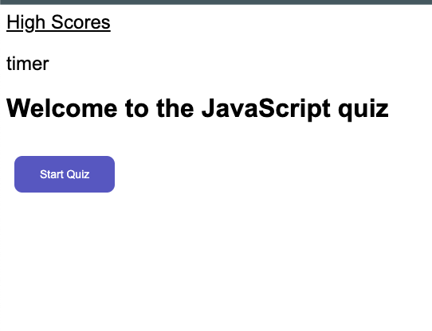

# Vanilla JavaScript Quiz  - Module 4 Challenge 

This quiz was built entirely out of vanilla JS. It was created to test my knowledge of JS which i have learnt so far in the bootcamp.

## Table of Contents
- [Link to live Quiz](#link-to-quiz)
- [Screenshot](#screenshot)
- [Challenges and learnings](#challenges-and-learnings)
- [Features](#features)
- [Getting Started](#getting-started)
  - [Prerequisites](#prerequisites)
  - [Running the Website](#running-the-website)
- [Built With](#built-with)
- [License](#license)
- [Acknowledgements](#acknowledgements)
- [Contact](#contact)

## Link to Quiz

- Click here to go to the quiz https://supershalala.github.io/javaScript-quiz

## Screenshot 

The following image shows the web application's appearance and functionality:

## Challenges and learnings
- I struggled with retriveing the stored scores from local storage and displaying them to highscores.
- Purposely didnt want much css styling as this task was about JS. Would use divs next time and hide/unhide them via css for nicer look. 
- Psudeo coding needs to be more consistent.
- Iterationg objects from an array to create an element then append as a child. This took many hours of research and trial and error!

 
## Features

- elements are created purely from JS
- able to save your initals against your score to local storage
- When you click on highscore it displays the highest 10 scores

## Getting Started

To run the website locally on your computer, you will need a code editor and a modern web browser.

## Prerequisites

Code editor (e.g. Visual Studio Code)
Modern web browser (e.g. Google Chrome, Mozilla Firefox)

## Running the Website

- Clone the repository to your local machine.
- Open the repository in your code editor.
- Open the index.html file in your web browser.

## Built With
HTML, CSS and JavaScrispt

## License
This project is licensed under the MIT License.

## Acknowledgements
- Mozilla Developer Network
- W3C Schools
- James Q Quick on Youtube - https://www.youtube.com/watch?v=jfOv18lCMmw&t=371s 
- Stack Overflow

## Contact
For questions or feedback, please contact:

Adam Shalala
Email: ashalala93@gmail.com
GitHub: https://github.com/supershalala

---
